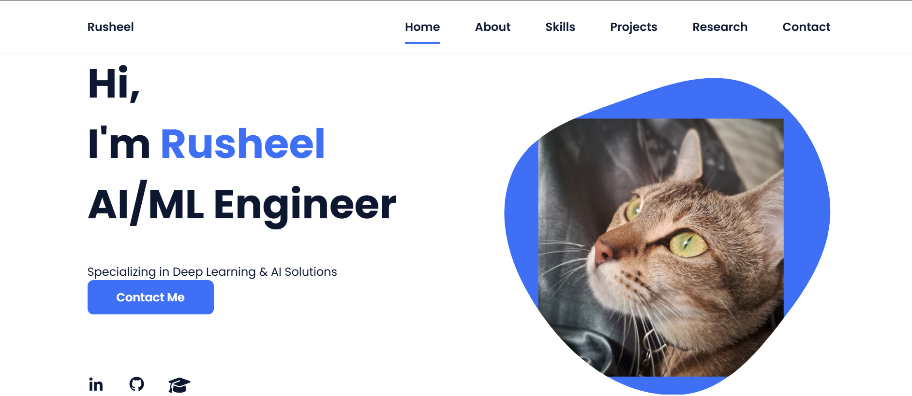

# 🤖 Rusheel's AI Portfolio

  
*Live demo: [https://RedEgnival.github.io/portfolio](https://RedEgnival.github.io/portfolio)*

A cutting-edge portfolio showcasing my machine learning expertise, AI projects, and research contributions. Built for technical recruiters and research collaborators.

## ✨ Highlights

- **Project Showcase**: Interactive display of LLM, CV, and ML projects
- **Research Section**: Peer-reviewed publications and preprints
- **Skills Visualization**: Interactive proficiency charts for AI stack
- **Dark/Light Mode**: Toggle for comfortable viewing
- **Performance Optimized**: 95+ Lighthouse score

## 🛠 Core Technologies

### AI/ML Stack

### Frontend

## 📂 Repository Structure

